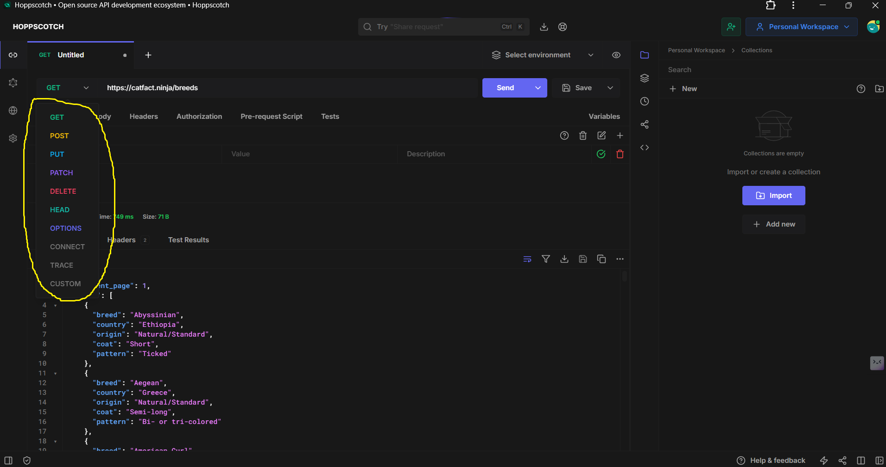

# API Testing Tools: Postman vs Hoppscotch & HTTP Verbs

## Section 1: API Testing Tools Introduction
**Speaker Update:**  
This section has been updated with new videos. Audio/visual changes may be present.

### Key Tools for API Testing
| Tool | Type | Signup Required | Link |
|------|------|-----------------|------|
| **Postman** | Developer Tool | ✅ Yes (now required) | [postman.com](https://www.postman.com) |
| **Hoppscotch** | Open-Source Alternative | ❌ No | [hoppscotch.io](https://hoppscotch.io) |

**Purpose:**  
Both tools help developers:
- Test API requests
- Inspect responses
- Save request configurations
- Work with headers/parameters

### Visual Comparison
```plaintext
POSTMAN                          HOPPSCOTCH
[Dropdown: GET/POST]             [Dropdown: GET/POST]
[URL Input]                      [URL Input]
[Send Button]                    [Send Button]
[Response Panel]                 [Response Panel]
```

### A few API endpoints examples
We can see API json data and few API endpoints using API test tools like hopscotch or postman. 
- [Star wars API / swapi reborn](https://swapi.info/)
- [Cat Fact API](https://catfact.ninja/#/)

---
## Section 2: HTTP Verbs Explained


### Common HTTP Verbs

| Verb    | Typical Use Case       | Example               |
|---------|------------------------|-----------------------|
| `GET`   | Retrieve data          | Fetch cat facts       |
| `POST`  | Send/create data       | Submit a form         |
| `PUT`   | Update entire resource | Edit user profile     |
| `PATCH` | Partial update         | Change password       |
| `DELETE`| Remove data            | Delete a post         |

#### Practical Demo
Using Hoppscotch: 
- Select GET from dropdown
- Enter URL: https://catfact.ninja/breeds
- Click "Send"
- View formatted JSON response
```http
POST https://catfact.ninja/breeds
Response: 404 Not Found
```
#### Screenshot for better understnading
The marked section is the https verbs. 



## Section 3: HTTP status code

### Overview
Status codes are 3-digit numbers returned in HTTP responses that indicate the result of a request. They follow a standardized pattern where the first digit defines the class of response.

### Status Code Classes

| Code Range | Type               | Description                          | Common Examples |
|------------|--------------------|--------------------------------------|-----------------|
| **1xx**    | Informational      | Request received, continuing process | 100, 102        |
| **2xx**    | Success            | Request successfully processed       | 200, 201        |
| **3xx**    | Redirection        | Further action needed                | 301, 304        |
| **4xx**    | Client Error       | Request contains errors              | 400, 404, 405   |
| **5xx**    | Server Error       | Server failed to fulfill request     | 500, 503        |

---

### Common Status Codes Examples

4xx Client Errors
1. 404 Not Found

- Example: Requesting invalid endpoint

```http
GET /api/planetts HTTP/1.1
→ 404 Not Found
```
2. 405 Method Not Allowed

- Example: Sending POST to GET-only endpoint

```http
POST /api/planets HTTP/1.1
→ 405 Method Not Allowed
```
3. Successful Request (SWAPI)
```http
GET https://swapi.dev/api/planets/1
Response: 200 OK
```
 - Error cases SWAPI**

Example - 1
```http
(Invalid endpoints)
GET https://swapi.dev/api/planetts
Response: 404 Not Found
```

Example - 2
```http
(Wrong HTTP Method:)
POST https://swapi.dev/api/planets
Response: 405 Method Not Allowed
```
## Section 4: Understanding Query Strings in HTTP request

### What is a Query String?
A query string is a part of a URL that contains additional parameters in `key=value` format, separated by ampersands (`&`). It appears after a question mark (`?`) in the URL.

**Basic Syntax:**
```link
https://example.com/path?key1=value1&key2=value2
```

---

### Key Characteristics
1. **Optional**: Servers ignore unrecognized query parameters

For example

```http
https://swapi.info/api/people/5?color=green&age=23&silly=yes
```
after 5 then query string is unrecogniable so it ignores it. it just gives back the information for 5th people. 

2. **Order Doesn't Matter**: `?color=blue&size=large` = `?size=large&color=blue`
3. **URL-Safe Encoding**: Spaces become `+` or `%20`, special characters are encoded

---

### Practical Examples

#### 1. Simple Query String (MDN Search)
```http
GET https://developer.mozilla.org/search?q=react
```
```http
https://api.tvmaze.com/search/shows?q=purple
```
Similarly we can also enter k value or other queries. You can experiment in your **Browser**, **Hopscotch** or **Postman**.  


## Section 5: HTTP Headers: Request and response Metadata

### What Are HTTP Headers?
Headers are key-value pairs that provide additional information about HTTP requests and responses. They act as metadata for the communication between clients and servers.

### Key Characteristics:
- **Format**: `Header-Name: header-value`
- **Location**: 
  - **Request Headers**: Sent by client to server
  - **Response Headers**: Returned by server to client
- **Purpose**: Control caching, authentication, content negotiation, etc.


### Viewing Headers in Browser DevTools
1. Open Chrome DevTools (`F12` or `Ctrl+Shift+I`)
2. Go to **Network** tab
3. Reload page
4. Select any request → Click "Headers" tab


---

## Common Header Examples

### Request Headers
| Header | Example Value | Purpose |
|--------|---------------|---------|
| `Accept` | `application/json` | Preferred response format |
| `Authorization` | `Bearer xyz123` | Authentication token |
| `User-Agent` | `Mozilla/5.0` | Client software info |

### Response Headers
| Header | Example Value | Purpose |
|--------|---------------|---------|
| `Content-Type` | `text/html` | Format of returned data |
| `Cache-Control` | `max-age=3600` | Caching instructions |
| `Server` | `nginx/1.18` | Server software info |

---

### Practical Example: [icanhazdadjoke API](https://icanhazdadjoke.com/api)

#### Default Request (Returns HTML)
```http
GET https://icanhazdadjoke.com/
```
To find json value we have to set header section key as **accept** and value as **application/json**. Then we get the json value like below. 
```json
{
  "id": "fVv4MRuHBsc",
  "joke": "How do robots eat guacamole? With computer chips.",
  "status": 200
}
```

