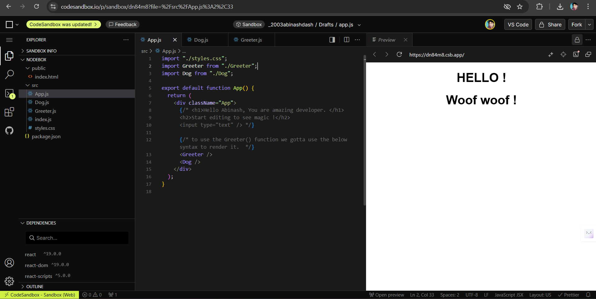

# React Learning Guide (Using CodeSandbox)

## 🚀 Introduction

We are starting our React journey using **[CodeSandbox](https://codesandbox.io/)** — an online code editor tailored for modern web development. It's fast, beginner-friendly, and doesn’t require any local setup. 

Later, we will transition to **VS Code** for a more customizable development environment.

---

## 🧑‍💻 Why CodeSandbox First?

- No installation required
- Perfect for quick prototyping
- Auto-saving of files and projects
- Easy to share your work with others

---

## 🌐 CodeSandbox Website

👉 Visit: [https://codesandbox.io](https://codesandbox.io)

---

## 🖼️ What CodeSandbox Looks Like

> 📸 Screenshot of CodeSandbox

---

## ✅ What's Next?

Once we are comfortable with the basics of React using CodeSandbox, we will:

- Set up React using `npm` and `create-react-app` in VS Code
- Learn how project structure works locally
- Use Git and GitHub for version control
